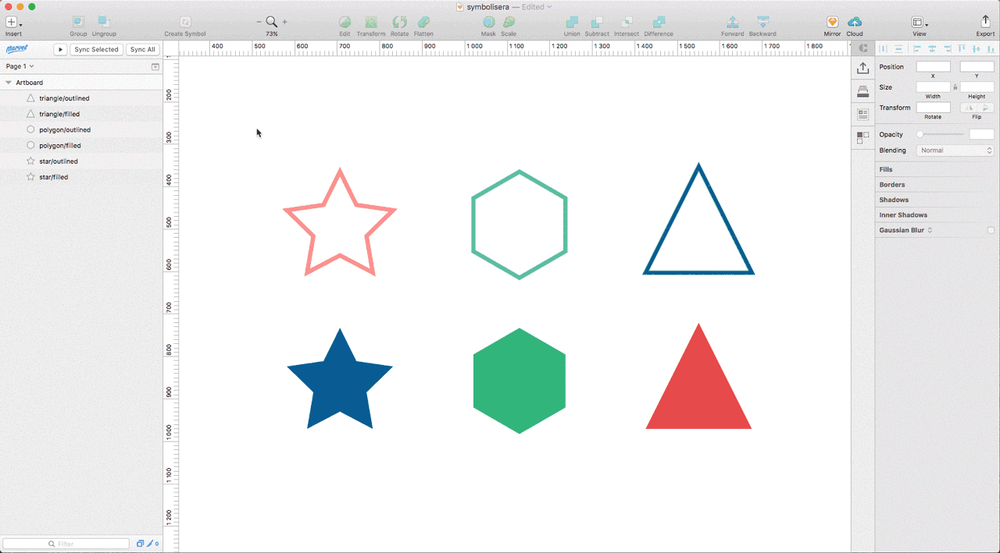

# Symbolisera
Plugin for creating symbols for each of your selected layers. Works great together with [RenameIt](https://github.com/rodi01/RenameIt).

## How to use
Begin with selecting the layers you want to create symbols from. Either click on **Plugins -> Symbolisera -> Create symbols from selection** or use the shortcut **⌃+⌘+D**. Easy peasy lemon squeezy.

